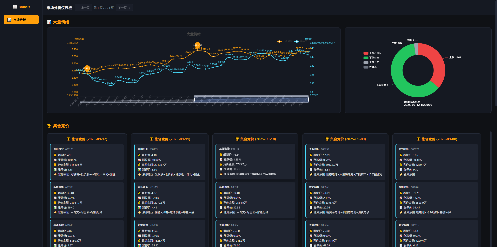
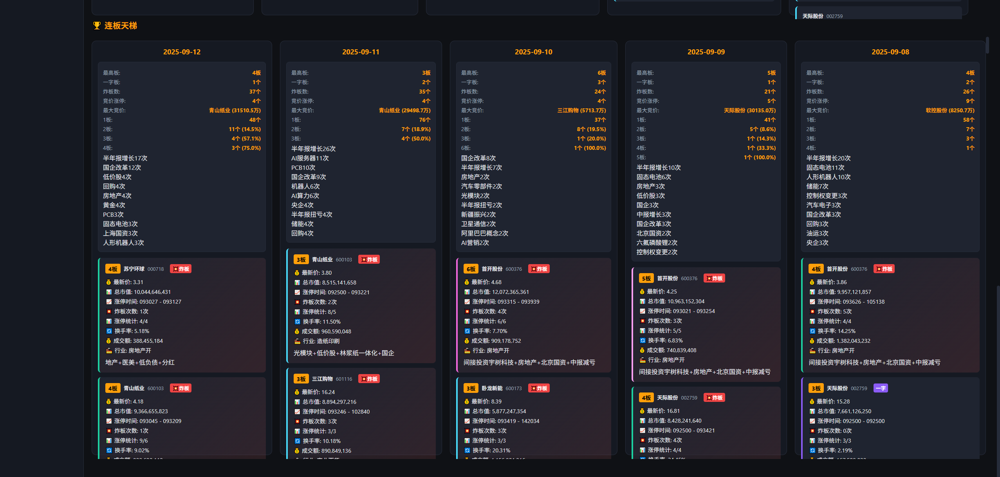

# 股票市场分析仪表板 - Bandit

##预览



## 📖 项目概述

Bandit是一个专业的股票市场分析仪表板，专注于涨停板数据分析和市场情绪监控。系统集成了实时数据获取、数据库存储、可视化展示和智能分析功能，为投资者提供全面的市场洞察。

## 🚀 快速开始

### 环境要求
- Python 3.8+
- MySQL 5.7+ (端口3309)
- 网络连接（用于获取实时数据）

### 1. 克隆项目
```bash
git clone <repository-url>
cd dayil_review
```

### 2. 安装依赖
```bash
pip install -r requirements.txt
```

### 3. 数据库配置
1. 确保MySQL服务运行在3309端口
2. 创建数据库 `stock_analysis`
3. 执行数据库迁移脚本（如果需要）

### 4. 首次运行数据同步
```bash
# 同步涨停数据（首次运行必须执行）
python -m data_access_layer.limitup_sync_api
```

### 5. 启动应用程序
```bash
# 启动主仪表板（强制使用数据库模式）
python main_enhanced.py
```

应用程序会自动在浏览器中打开仪表板界面。

## 📊 核心功能

### 🏆 连板天梯
- 显示最近5个交易日的涨停个股数据
- 按连板数分级显示（1板到8板）
- 标识一字板、炸板等特殊状态
- 显示个股详细信息：价格、市值、换手率、成交额等
- 题材概念标签展示

### 📈 大盘情绪
- 实时大盘拥挤度图表
- 市场状态分布饼图
- 双Y轴折线图展示大盘点数和拥挤度
- 警戒线标识和市场状态统计

### 🏆 集合竞价
- 集合竞价涨停个股展示
- 按竞价金额从大到小排序
- 显示最大竞价金额的股票
- 竞价金额以"万"为单位显示

### 📊 数据统计
- 每日涨停统计：最高板、一字板数量、炸板数量
- 连板晋级率计算
- 题材概念热度排名
- 竞价数据汇总

## 🛠️ 技术栈

### 后端技术
- **Python 3.8+** - 核心编程语言
- **Pandas 2.1.4** - 数据处理和分析
- **PyMySQL 1.1.0** - MySQL数据库连接
- **akshare** - 实时股票数据获取
- **pywencai** - 涨停原因数据查询
- **tqdm** - 进度条显示

### 前端技术
- **PyEcharts 2.0.3** - 数据可视化图表
- **Plotly 5.18.0** - 交互式图表
- **Jinja2 3.1.2** - HTML模板渲染
- **HTML5/CSS3/JavaScript** - 响应式前端界面

### 数据库
- **MySQL 5.7+** - 数据存储（端口3309）
- 表结构包括：limitup_pool, pre_market_auction, market_sentiment等

## 📁 项目结构

```
dayil_review/
├── main_enhanced.py              # 主应用程序入口
├── database.py                   # 数据库操作核心类
├── database_config.py            # 数据库配置管理
├── config.py                     # 应用程序配置
├── requirements.txt              # Python依赖包列表
├── README.md                     # 项目说明文档
├── CLAUDE.md                     # Claude代码助手配置
├── DEVELOPMENT.md                # 开发指南
│
├── data_access_layer/            # 数据访问层
│   ├── limitup_sync_api.py       # 涨停数据同步API
│   ├── akshare_access.py         # akshare数据接口
│   ├── database_access.py        # 数据库访问工具
│   ├── utility_functions.py      # 工具函数
│   └── __init__.py               # 包初始化
│
├── demo/                         # 演示脚本
│   ├── akshare_demo.py           # akshare功能演示
│   ├── database_demo.py          # 数据库操作演示
│   └── akshare_data_loader.py    # 数据加载演示
│
├── test/                         # 测试用例
│   ├── test_database.py          # 数据库完整测试
│   ├── test_database_logic.py    # 逻辑功能测试
│   └── debug_test.py             # 调试测试
│
├── output/                       # 生成的HTML输出文件
├── templates/                    # HTML模板文件
├── static/                       # 静态资源文件
│   ├── css/                      # 样式表
│   └── js/                       # JavaScript文件
└── docs/                         # 文档目录
    ├── README.md                 # 详细设计文档
    ├── DATABASE_SETUP.md         # 数据库设置指南
    ├── AKSHARE_INTEGRATION_SUMMARY.md  # akshare集成说明
    └── PROJECT_STRUCTURE.md      # 项目结构说明
```

## 🔧 开发命令

### 安装和运行
```bash
# 安装所有依赖
pip install -r requirements.txt

# 运行主应用程序
python main_enhanced.py

# 同步涨停数据
python -m data_access_layer.limitup_sync_api
```

### 测试和验证
```bash
# 运行完整测试套件
python -m pytest test/ -v

# 运行数据库测试
python test/test_database.py
python test/test_database_logic.py

# 运行演示脚本
python demo/database_demo.py
python demo/akshare_demo.py
```

### 代码质量检查
```bash
# 语法检查
python -m py_compile main_enhanced.py

# 代码规范检查
pylint main_enhanced.py database.py database_config.py
```

## 📋 功能特性

### ✅ 已实现功能
- **实时数据集成**: 使用akshare获取最新股票数据
- **数据库支持**: MySQL完整CRUD操作和批量插入
- **数据同步**: 涨停数据自动同步和增量更新机制
- **可视化展示**: PyEcharts和Plotly图表渲染
- **响应式设计**: 暗色主题现代化UI界面
- **性能优化**: 线程超时保护和优雅降级
- **错误处理**: 完善的异常处理和日志记录

### 🔄 数据流架构
1. **数据采集**: akshare API → 数据清洗 → 数据库存储
2. **数据处理**: 数据库查询 → 类型转换 → 业务逻辑处理
3. **可视化**: 数据聚合 → 图表生成 → HTML渲染
4. **展示**: 浏览器渲染 → 用户交互 → 数据更新

## ⚙️ 配置说明

### 数据库配置
- 默认端口: 3309
- 数据库名: stock_analysis
- 连接配置: database_config.py
- 测试模式: test_mode=True 使用测试配置

### 应用程序配置
- 主题颜色: config.py 中定义
- 数据源设置: 实时数据/模拟数据切换
- 超时设置: 线程超时保护机制

## 🚨 注意事项

### 数据库依赖
- 应用程序强制使用数据库模式，必须配置MySQL服务
- 确保MySQL运行在3309端口
- 首次运行前必须执行数据同步

### 数据类型安全
- 所有数据库操作包含在try-catch块中
- 自动处理PyMySQL的Decimal/datetime类型转换
- HTML模板渲染前调用 `_convert_db_data()` 方法

### 网络要求
- 需要稳定的网络连接获取实时数据
- akshare API调用可能受网络环境影响
- 支持离线模式（使用缓存数据）

## 📈 数据模型

### 主要数据表
- `limitup_pool`: 涨停池数据（代码、名称、板数、题材等）
- `pre_market_auction`: 集合竞价数据（竞价金额、涨停原因等）
- `market_sentiment`: 市场情绪指标数据

### 数据字段
- 股票代码、名称、价格、涨跌幅
- 连板数、一字板标识、炸板次数
- 成交额、市值、换手率
- 题材概念、行业分类
- 时间戳、创建时间、更新时间

## 🔍 高级用法

### 自定义数据同步
```python
from data_access_layer.limitup_sync_api import sync_limitup_data

# 同步指定天数的数据
result = sync_limitup_data(days=7)
print(f"同步结果: {result}")
```

### 数据查询接口
```python
from data_access_layer.limitup_sync_api import get_recent_limitup_data

# 获取最近N天的涨停数据
data = get_recent_limitup_data(5)
print(f"获取到 {len(data)} 条数据")
```

### 自定义图表配置
```python
# 在main_enhanced.py中修改图表配置
def create_congestion_chart(self):
    # 自定义图表样式和配置
    line_chart = Line(init_opts=opts.InitOpts(theme=ThemeType.DARK))
    # ... 图表配置代码
```

## 🤝 贡献指南

1. Fork 本项目
2. 创建特性分支 (`git checkout -b feature/AmazingFeature`)
3. 提交更改 (`git commit -m 'Add some AmazingFeature'`)
4. 推送到分支 (`git push origin feature/AmazingFeature`)
5. 开启Pull Request

## 📄 许可证

本项目仅供学习和研究使用，不构成投资建议。请遵守相关法律法规。

## 🆘 技术支持

- 查看 [开发指南](DEVELOPMENT.md) 了解详细开发信息
- 检查 [数据库设置指南](docs/DATABASE_SETUP.md) 解决数据库问题
- 参考 [akshare集成说明](docs/AKSHARE_INTEGRATION_SUMMARY.md) 了解数据源配置

---

**免责声明**: 本项目为股票市场分析工具，所有数据仅供参考，不构成任何投资建议。投资者应自行承担投资风险。